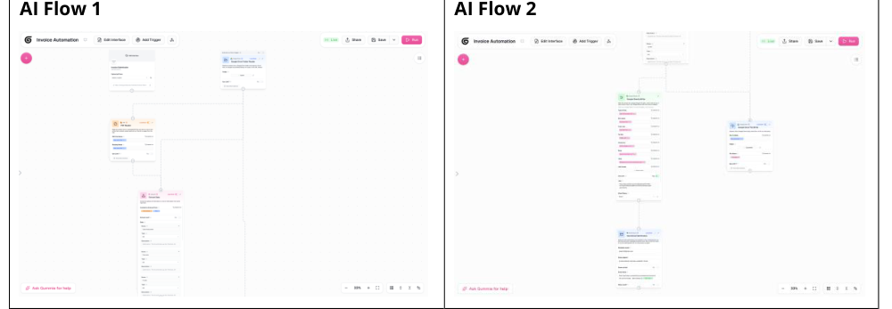
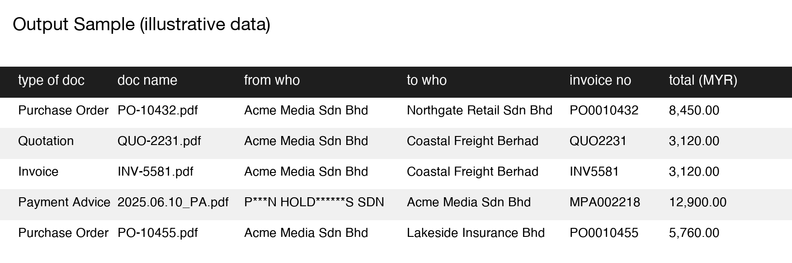

# Invoice OCR Pipeline (Gumloop)

An advertising agency's finance lead was hospitalized mid-transition to Malaysia's e-invoice compliance requirements. Invoices weren't being tracked, the audit trail had gaps, and reconciliation was falling behind — with no backup process. This wasn't an efficiency project, it was business continuity.

**The problem.** Paper-based invoice handling required manual transcription — 3–4 hours a week, single point of failure, no documented process if the one person who ran it was unavailable.

**The bet.** Build a production OCR pipeline, not a proof of concept, prioritizing audit trail and reliability over cleverness:

1. **Intake** — invoice dropped in a cloud folder triggers processing automatically.
2. **OCR extraction** — Gumloop pulls vendor, invoice number, amount, currency, dates, line items, GL codes across variable invoice formats without custom training per vendor.
3. **Validation** — flags missing fields, out-of-range amounts, duplicates; approves the rest for posting.
4. **Audit trail** — every extraction logged with timestamp and confidence score, full traceability for compliance.

**What I cut.** An ERP system or custom-trained ML model. Gumloop's OCR plus a Google Sheets output matched what the agency's budget and existing finance workflow could actually absorb — no retraining staff on new software mid-crisis.

**Results.**

| Metric | Before | After |
|---|---|---|
| Weekly processing | 3–4 hrs | ~1.75 hrs/month |
| Data entry errors | 8–12/month | <1/month |
| Audit trail | Manual, incomplete | 100% logged |

~161 hours/year recovered, 95% fewer entry errors.

**What I'd do differently.** The system was sized for ~50 invoices/month with headroom to 250+ on the same architecture — that headroom was a deliberate bet, not padding, since the agency was actively scaling. If I rebuilt it today I'd add an alerting step for low-confidence extractions instead of relying on the validation layer catching everything silently.

---
Output sample above uses illustrative data — real vendor/client names and amounts swapped for placeholders.
