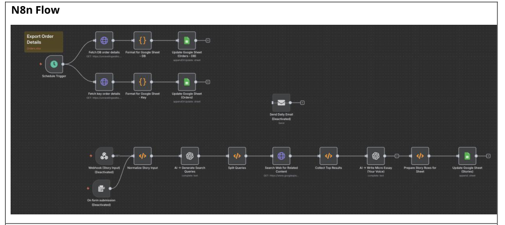

# E-Commerce Order Audit Reports (n8n)

A solopreneur's e-commerce business needed weekly financial reporting — reconciled against payment gateways, audit-ready, distributed to stakeholders — without paying for a SaaS reporting tool.

**The problem.** Orders, payment gateway data, and spreadsheets lived in three disconnected places. Compiling and cross-referencing them by hand took 2–3 hours a week and still left audit gaps.

**The bet.** Build the whole pipeline on n8n, self-hosted, so it costs nothing to run and scales without a platform migration:

1. **Trigger** — runs every Friday at midnight, off-peak.
2. **Extraction** — pulls the week's orders via the WooCommerce API.
3. **Transform** — maps raw order data to a standard reporting schema (revenue categories, product groupings, customer segments).
4. **Enrichment** — derives margins, processing fees, tax, period-over-period comparisons.
5. **Report** — structured CSV with anomaly flags and YTD comparisons.
6. **Distribution** — emails the report and archives a copy to Drive.

**What I cut.** Zapier or Make — both would've worked, but at RM300–600/year in recurring cost for a workflow that runs once a week. n8n self-hosted on existing infrastructure meant zero marginal cost per run, and API-first design so adding Shopify or Stripe later doesn't mean rebuilding the pipeline.

**Results.**

| Metric | Before | After |
|---|---|---|
| Weekly report time | 2–3 hrs | ~5 min |
| Audit trail | Partial, manual | Fully automated |
| Infra cost | — | RM0 |

~126 hours/year recovered. ~8 hours to build, under an hour of maintenance per quarter since.

**What I'd do differently.** The workflow fails loudly on purpose — if the WooCommerce API call fails, it logs and alerts rather than silently skipping a week. That was a deliberate call after the invoice pipeline taught me silent failures are worse than loud ones in anything touching finance. Current volume is ~20 orders/week against headroom for 500+; I'd revisit the async handling once it's actually load-bearing rather than speculative.

---
Screenshots of the actual agent configs and output samples available on request.
