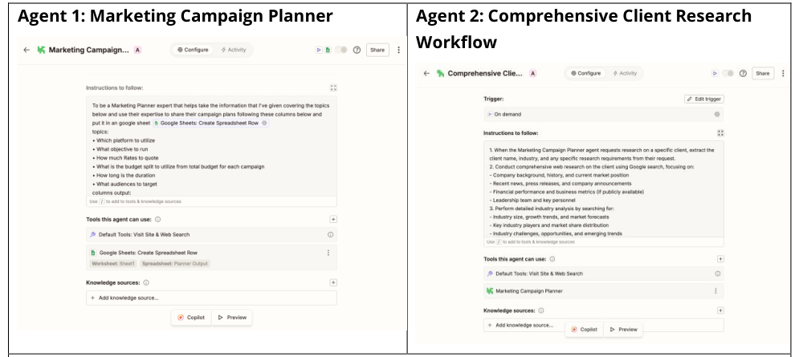
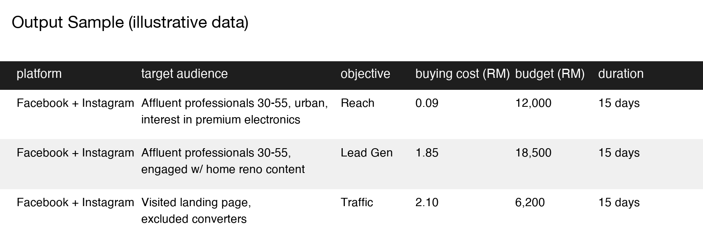

# Multi-Agent Campaign Planner (Zapier)

A freelancer expanding into Upwork needed to deliver expert-level campaign planning and market research per client without hiring a planner — while keeping turnaround fast and overhead near zero.

**The problem.** Manual onboarding, campaign planning, and competitive research ate 5+ hours a week. That's roughly 260 hours a year that could've gone to higher-value client and strategy work instead.

**The bet.** Rather than speed up the manual process, redesign it as two interconnected agents that actually make decisions, not just a chain of fixed steps:

- **Agent 1 — Campaign Planner.** Takes client inputs (platform, budget, objectives, audience) and produces a full campaign plan — platform mix, budget allocation, targeting, KPIs, timeline — written straight to Google Sheets for review.
- **Agent 2 — Market Research Analyst.** Triggered by Agent 1 on demand when it needs competitive intel. Runs its own multi-source research (company background, industry trends, competitor positioning), cross-checks sources, and returns a cited brief.

This is the one project here I'd actually call agentic — Agent 2 decides what to search and how to synthesize it, and Agent 1 decides when to call Agent 2. The other automations in this series are fixed pipelines; this one has real branching.

**What I cut.** Custom LLM integration. Zapier's AI Agent builder gave up some customization for speed-to-market, which was the right trade for a one-person operation — the bottleneck was hours in the week, not model flexibility.

**Where the human stays in the loop.** Every output lands in Sheets for review before it reaches a client. The agents handle research and first-draft synthesis; judgment and the client relationship stay human.

**Results.**

| Metric | Before | After |
|---|---|---|
| Client onboarding | 5–6 hrs | 45 min |
| Weekly time spent | 5 hrs | ~30 min |
| Research sourcing | Single-source | Multi-source, cross-checked |

~260 hours/year recovered.

**What I'd do differently.** Google Sheets was the right integration layer to ship fast, but it's the ceiling too — the next version would need a proper review UI once client volume grows past what a spreadsheet handoff can absorb cleanly.

---
Output sample above uses illustrative data — real client budgets and targeting swapped for placeholders.
